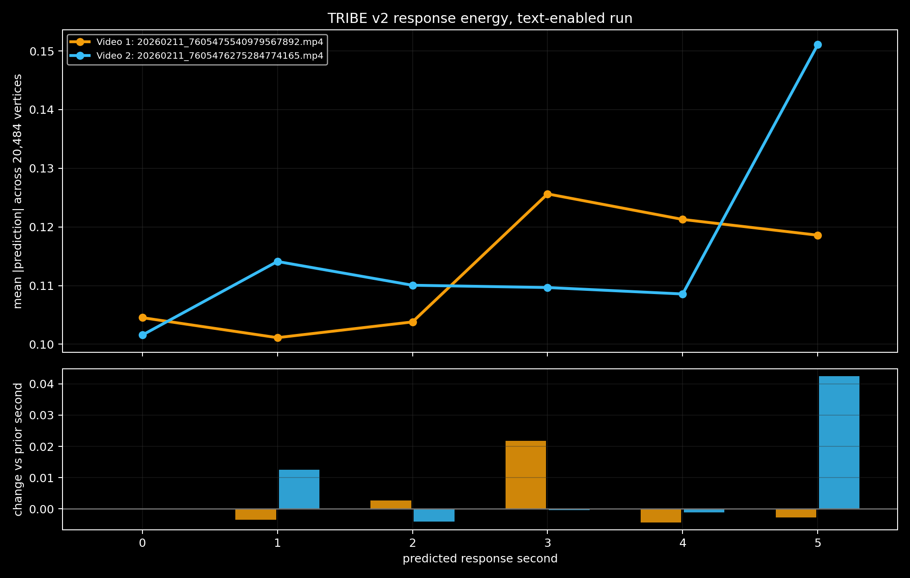
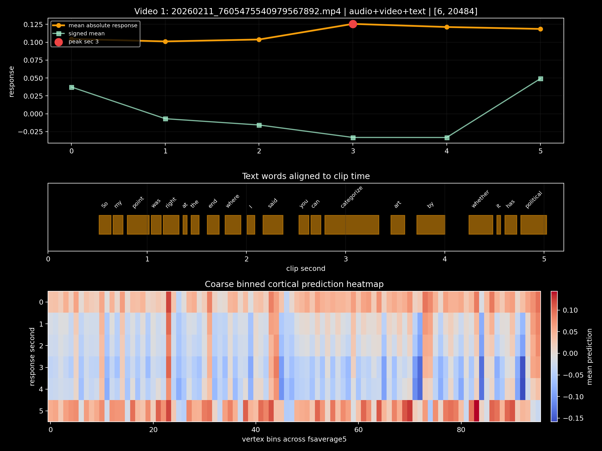
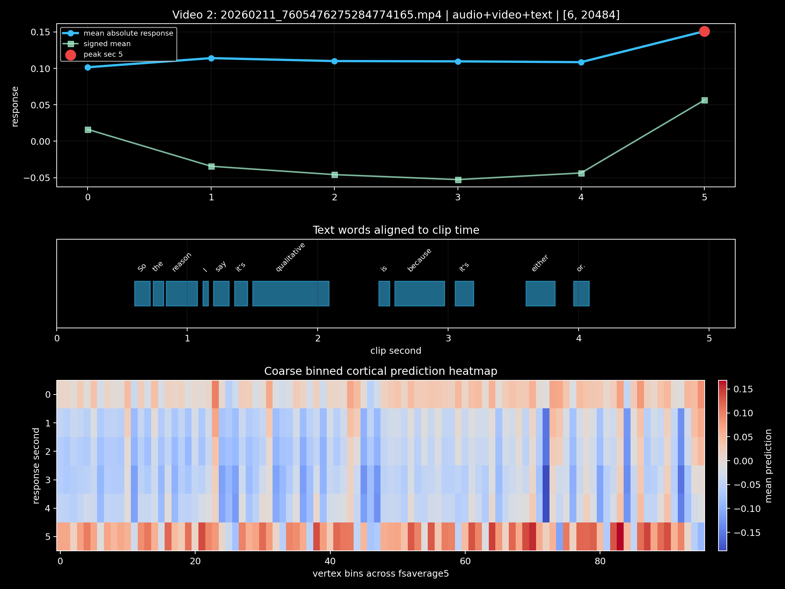

# TRIBE v2 Video Pilot

Two 5-second social video clips were run through TRIBE v2 with audio, video,
and text enabled.

Job: `1e1dcedd43534c67abb28eacb4a8b727`

## Videos

1. [`7605475540979567892`](https://www.tiktok.com/@vanjao.plays/video/7605475540979567892)
   - Text: `So my point was right at the end where i said you can categorize art by whether it has political`
   - Output shape: `[6, 20484]`
   - Peak: second `3`

2. [`7605476275284774165`](https://www.tiktok.com/@vanjao.plays/video/7605476275284774165)
   - Text: `So the reason i say it's qualitative is because it's either or`
   - Output shape: `[6, 20484]`
   - Peak: second `5`

## Read

Video 2 has the bigger late spike: response energy jumps from `0.1086` to
`0.1511` at second `5`, about `+39%`, right after the phrase `either or`.

Video 1 has a smaller mid-clip peak at second `3`, about `+21%`, around
`categorize / art / by`.

## Visuals

## Files

- [Results zip](tribev2-results.zip)
- [Status JSON](status.json)
- [Analysis JSON](visuals/analysis_summary.json)
